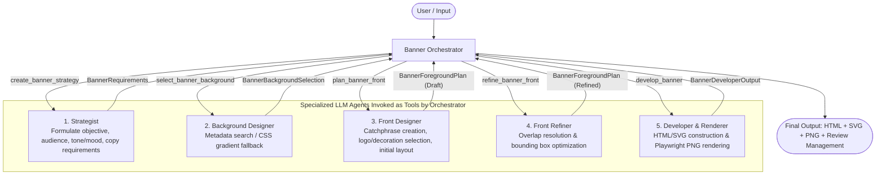

**English** | [日本語](README.md)

# Intentionally Retrofitted BannerAgency

A multi-agent production system where an Orchestrator sequentially invokes multiple specialized LLM agents (powered by OpenAI) as tools, collaborating to automatically generate high-quality advertising banners (**HTML / SVG / High-Resolution PNG**).

* While implementing the design philosophy of BannerAgency, this system **intentionally avoids the use of text-to-image (T2I) generative AI**, adopting a **vector & HTML-first** banner generation pipeline leveraging metadata search over existing assets and refined CSS/SVG layouts.

---

## 1. System Overview & Architecture

Based on the design principles of the paper **"BannerAgency: Advertising Banner Design with Multimodal LLM Agents"**, this system is tailored for banner production under specific environments that **intentionally avoid text-to-image (T2I) AI**.
It implements a **vector & HTML-first** banner generation pipeline utilizing metadata search for existing assets and sophisticated CSS/SVG layouts.
With a Human-in-the-Loop approach, users can not only monitor the AI agents' operations but also directly inspect, modify, and re-render banners themselves.



### Agent Roles
1. **Orchestrator (`orchestrator`)**: Receives banner creation requests from the user, sequentially invokes specialized agents as tools, and consolidates the generated results across iterations.
2. **Strategist (`strategist`)**: Formulates the advertising objective, target audience, tone & manner, and essential copy requirements.
3. **Background Designer (`background_designer`)**: Searches metadata JSON files in `assets/backgrounds` to select the optimal background image (or designs a refined CSS gradient if no suitable asset exists).
4. **Front Designer (`front_designer`)**: Selects the main copy (catchphrase), sub-copy, CTA button, logo asset, decorative badge, and creates the initial layout.
5. **Front Refiner (`front_refiner`)**: Detects and resolves coordinates, dimensions, and overlaps among elements, optimizing their placement within the canvas bounding box.
6. **Developer & Renderer (`developer`)**: Generates editable HTML/CSS and SVG banners, and renders high-resolution PNG previews using Playwright.

---

## 2. Key Features

- **Multi-Format Output (HTML / SVG / PNG)**:
  Simultaneously exports web-ready HTML, vector-editable SVG, and high-resolution PNG for preview and ad delivery.
- **Full Portability via Base64 Data URI**:
  Local image assets, logos, and decorative badges are embedded inline into HTML and SVG as Base64 Data URIs, allowing standalone viewing without CORS restrictions or broken relative paths.
- **2-Pass Conflict Resolution Guardrails**:
  Automatically detects and resolves overlaps between logos and decorative badges, as well as physical vertical collisions among text elements (main copy, sub-copy, and CTA).
- **Auto-Detection of Recently Edited Files & Smart `Render`**:
  After manually tweaking exported HTML or SVG files in an editor, executing `Render` in the interactive menu automatically detects the **most recently modified file** and immediately re-renders the PNG preview. *(Note: `playwright` is commented out by default in `requirements.txt`; please enable it if you wish to use PNG rendering).*
- **Sample Assets Included**:
  Comes with ready-to-use backgrounds (5 types), logos (4 types), and decorative badges (4 types) designed for Sale, Tech, Organic, and Luxury campaigns.

---

## 3. Setup Guide

### 1. Create Virtual Environment & Install Dependencies
```bash
# Create virtual environment
python3 -m venv .venv

# Activate virtual environment
source .venv/bin/activate  # macOS / Linux
# On Windows: .venv\Scripts\activate

# Install dependencies
pip install -r requirements.txt
```

### 2. Configure Environment Variables (OpenAI API Key)
Copy `.env.example` to create `.env` and set your OpenAI API key.
```bash
cp .env.example .env
```

`.env` configuration:
```env
OPENAI_API_KEY=sk-proj-xxxxxxxxxxxxxxxxxxxxxxxx
# Optional: Model selection (default: gpt-4o)
# OPENAI_MODEL=gpt-4o
# Optional: Default ON/OFF for Playwright PNG rendering (true/false)
# ENABLE_PLAYWRIGHT_RENDER=false
```

### 3. (Recommended) Install Playwright Browser
Install the Chromium browser if you want automatic PNG preview rendering (can be skipped if you only need HTML/SVG files).
```bash
playwright install chromium
```

---

## 4. How to Run

### Interactive Mode
```bash
python src/main.py
```
After launching, you will be prompted for the banner objective, dimensions, and whether to enable Playwright PNG rendering. The multi-agent system will then begin generation.

#### Review Actions in Interactive Menu
After each iteration completes, you can perform the following actions:

| Action | Description |
| :--- | :--- |
| **`OK` / `approve`** | Approves the current banner and finishes the creation session. |
| **`Comment` / `c`** | Input revision requests (e.g., "Increase margin between copies", "Make CTA button yellow") to trigger the next design iteration with the agents. |
| **`Render` / `r`** | **Automatically detects the most recently edited HTML or SVG file** and immediately regenerates the PNG preview without calling the LLM. (You can also specify a file explicitly, e.g., `render banner_iter2.svg`). |
| **`Exit` / `quit`** | Aborts and exits the banner creation session. |

### Command Line Arguments Execution
```bash
# Standard execution (Interactive review mode)
python src/main.py --objective "Spring Campaign Sale Banner" --width 300 --height 250

# With Playwright PNG preview rendering enabled
python src/main.py --objective "Cybersecurity Software Sale Banner" --width 300 --height 250 --render-png

# Non-interactive mode (Automatically finishes after 1 iteration)
python src/main.py --objective "AI SaaS User Acquisition Banner" --non-interactive
```

---

## 5. Output File Structure

Generated artifacts are saved in `artifacts/output/`:

```text
artifacts/
├── output/
│   ├── banners/
│   │   └── <banner_id>/              # Session-specific output folder (e.g., 20260921_122325)
│   │       ├── banner.html           # Latest iteration HTML banner (reloadable in browser)
│   │       ├── banner.svg            # Latest iteration SVG banner
│   │       ├── banner.png            # Latest iteration high-resolution PNG preview
│   │       ├── banner_iter1.html     # Iteration 1 history
│   │       ├── banner_iter1.svg
│   │       ├── banner_iter1.png
│   │       ├── banner_iter2.html     # Iteration 2 history
│   │       └── ...
│   └── graph/
│       └── banner_graph_<banner_id>.md   # Mermaid execution workflow graph
```

---

## 6. Asset Structure & Adding New Assets

Place image files (SVG / PNG / JPG) alongside a `.json` metadata file of the same name under the `assets/` directory. The agents will automatically search and select them.

```text
assets/
├── backgrounds/         # Background assets (spring_sale, tech_blue, warm_sunset, natural_mint, luxury_dark)
├── logos/               # Logo assets (circle, shield, leaf, hex)
└── decorations/         # Decorative badges (ribbon, discount_burst, new_tag, special_crown)
```

**Example Metadata JSON (`assets/backgrounds/warm_sunset_bg.json`):**
```json
{
  "id": "warm_sunset_bg",
  "name": "Warm Sunset Energy Gradient",
  "category": "background",
  "theme": "sale, campaign, vibrant, energetic, warm, orange, red, sunset",
  "description": "A dynamic and vibrant warm sunset gradient with energetic glowing accents, perfect for urgent promotions.",
  "recommended_mood": "energetic, passionate, urgent, warm, vibrant",
  "dimensions": {
    "width": 1200,
    "height": 1000
  }
}
```

---

## 7. Running Tests

```bash
# Run tests within the virtual environment
.venv/bin/pytest
# or
pytest
```
Verifies asset loading, HTML/SVG generation, Base64 Data URI inlining, collision guardrails, and auto-detection re-rendering.

---

## 8. Citations & References

This project is inspired by the design philosophy of the following paper and repository:
- **Paper**: [arXiv:2503.11060](https://arxiv.org/abs/2503.11060)
- **Official Repository**: [sony/BannerAgency](https://github.com/sony/BannerAgency)
- **Project Page**: [https://banneragency.github.io/](https://banneragency.github.io/)

```bibtex
@inproceedings{wang2025banneragency,
  title     = {BannerAgency: Advertising Banner Design with Multimodal LLM Agents},
  author    = {Wang, Heng and Shimose, Yotaro and Takamatsu, Shingo},
  booktitle = {Proceedings of the 2025 Conference on Empirical Methods in Natural Language Processing (EMNLP)},
  year      = {2025}
}
```

---

## 9. License

This project is released under the [MIT License](LICENSE).
